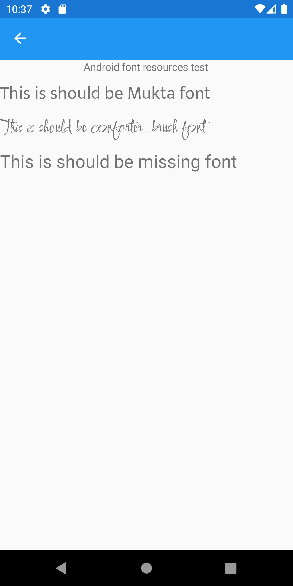

# Angpysha.Plugin.XamarinHelpTools
*Help tools for Xamarin Forms*



[](https://www.nuget.org/packages/Angpysha.Plugin.XamarinHelpTools) 

This package contains a collection of help tools for simplification of developing proccess. 

## Functionality
* **AsyncCommandEx** - extended async command with CanExecute binding. You do not need to call **ChangeCanExecute()** now. 
* **AsyncValueCommandEx** - extended async ValueTask command with CanExecute binding. You do not need to call **ChangeCanExecute()** now.
* **BrushedTextEffect** - add support to fill text using Xamarin.Forms brushes and also provided ImageBrush
* **AndroidTextOptionsEffect** - for now contains only attached property to support Android font resources

**P. S. New functions will be regulary added**

## Installation
To get this package install in nuget package manager in your IDE or type in terminal:
```
    Install-Package Angpysha.Plugin.XamarinHelpTools
```

## Documentaion
More details is in Wiki

## Credits
* [Xamarin Community Toolkit](https://github.com/xamarin/XamarinCommunityToolkit) - for sources for AsyncCommand

* [Xamarin Forms](https://github.com/xamarin/Xamarin.Forms)